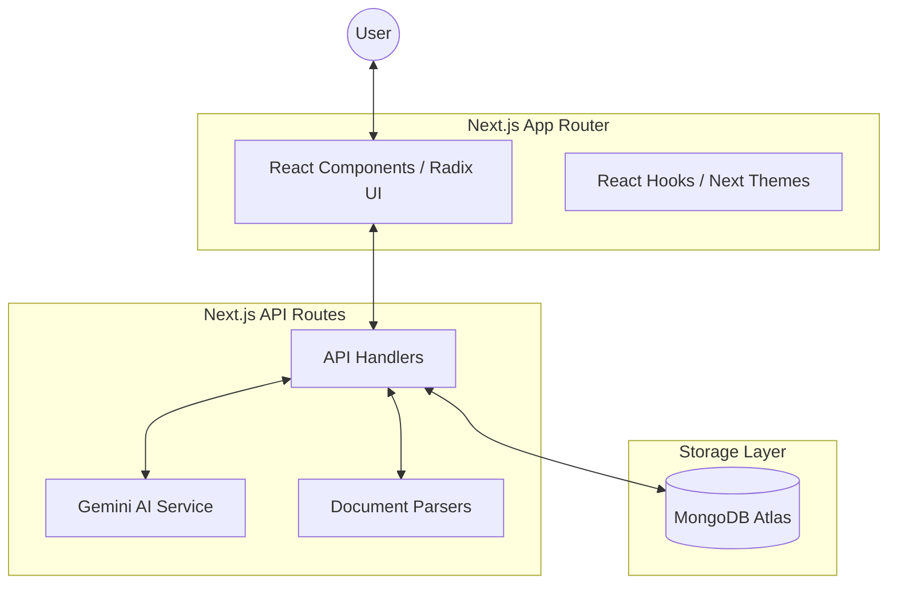

# Technical Architecture: ExamWise AI

ExamWise AI is built on a modern, serverless-first stack designed for scalability and rapid AI integration.

## 🏗️ High-Level Overview

## 💻 Frontend Stack
- **Framework**: [Next.js 15+](https://nextjs.org/) (App Router)
- **Styling**: [Tailwind CSS](https://tailwindcss.com/) with `tailwindcss-animate`.
- **Components**: [Radix UI](https://www.radix-ui.com/) for accessible, unstyled primitives.
- **Icons**: [Lucide React](https://lucide.dev/).
- **Data Visualization**: [Recharts](https://recharts.org/) for activity and trend analysis.

## ⚙️ Backend Logic
- **API Routes**: Standard Next.js Route Handlers (`app/api/...`).
- **AI Integration**:
    - Uses the `@google/generative-ai` SDK.
    - Centralized configuration in `lib/ai/config.ts`.
    - Streamlined chat logic in `lib/ai/chat-service.ts`.
- **Document Processing**:
    - **PDF**: `pdf-parse` and `pdfjs-dist`.
    - **Office Docs**: `officeparser`.
    - **YouTube**: `youtube-transcript`.

## 🗄️ Database (MongoDB Atlas)
- **Client**: `mongodb` (Node.js Driver).
- **Collections**:
    - `users`: Profiles and settings.
    - `chats`: Conversation history and metadata.
    - `knowledge_base`: Parsed text and source references.
    - `activities`: Global user interactions for "Hot Topics" analysis.

## 🔄 Data Flow: Chat with Knowledge Base
1. **Ingestion**: User uploads a file or provides a YouTube link.
2. **Parsing**: The backend parses the content into raw text.
3. **Storage**: The text is stored in the `knowledge_base` collection associated with the user.
4. **Retrieval**: When a chat starts, relevant context from the KB is fetched.
5. **Inference**: The context is injected into the Gemini prompt for grounded answers.
6. **Response**: The AI response is streamed back to the user and saved to the `chats` collection.
